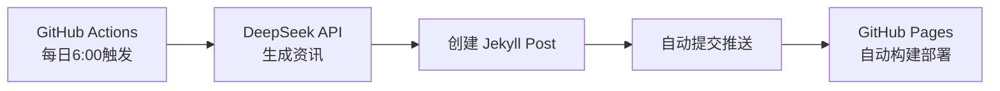

# 📖 关于本站

## 这是什么？

**我的早报** 是一个基于 [BestBlogs](https://github.com/ginobefun/BestBlogs) 的自建版 AI 资讯站点。

每天早晨 6:00，GitHub Actions 自动调用 **DeepSeek API** 生成当日最重要的 AI/科技精选资讯，并通过 GitHub Pages 发布。

## 技术架构

- 🤖 **AI 引擎**: DeepSeek Chat API
- 📝 **静态网站**: Jekyll + GitHub Pages
- ⚡ **自动化**: GitHub Actions
- 🆓 **完全免费**: 零成本托管

## 关于 BestBlogs

[BestBlogs.dev](https://bestblogs.dev) 是一个 AI 驱动的个人阅读助手，为您从海量 RSS、Newsletter、Twitter、YouTube 和播客内容中，筛选和提炼真正值得深度阅读的内容。

- AI 六维评分 + 专家策展
- 个性化早报 + AI 伴读
- 中英双语内容池
- 已积累 **20,000+** 注册用户

👉 [访问 BestBlogs.dev](https://bestblogs.dev)

## 致谢

感谢 [@ginobefun](https://github.com/ginobefun) 开源 BestBlogs 项目。
